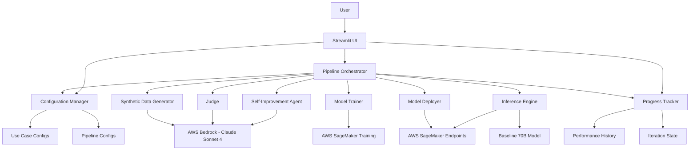
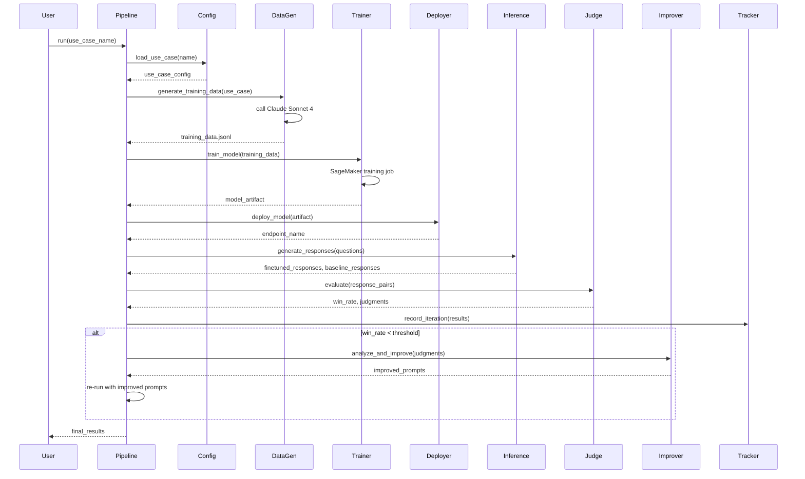

# Design Document: Automated LLM Finetuning Pipeline

## Overview

The automated LLM finetuning pipeline is a Python-based system that orchestrates the complete lifecycle of model finetuning with self-improvement capabilities. The system automates synthetic data generation, model training on AWS SageMaker, deployment, evaluation against baseline models, and iterative improvement through automated prompt optimization.

The architecture follows a class-based design with clear separation of concerns, building on proven patterns from the existing manual pipeline (documented in `.kiro/specs/llm-finetuning-pipeline-best-practices/requirements.md`) while adding automation, configuration management, and self-improvement capabilities.

### Governing Best Practices

This design is governed by the best practices abstracted from the production manual pipeline. Key practices that are preserved and enhanced:

**From Best Practices Requirements**:
- **Pipeline Stage Organization (Req 1)**: Maintained clear sequential stages, now orchestrated programmatically
- **Configuration Management (Req 2)**: Enhanced with YAML-based use case configs and validation
- **Training Data Generation (Req 3)**: Preserved Claude Sonnet 4 via Bedrock, JSONL format, batch processing, unicode cleaning
- **Model Fine-tuning (Req 4)**: Preserved SageMaker JumpStart, LoRA config, dataset-based hyperparameter optimization
- **Model Deployment (Req 5)**: Preserved JumpStartModel deployment, endpoint testing, instance type configuration
- **Response Generation (Req 6)**: Preserved retry logic, progress saving, response cleaning
- **Answer Combination (Req 7)**: Preserved side-by-side comparison format
- **Automated Judging (Req 8)**: Preserved Claude Sonnet 4 judging, win rate calculation, progress saving
- **Error Handling (Req 9)**: Preserved exponential backoff, progress persistence, validation
- **File Organization (Req 10)**: Preserved event_files structure with subdirectories
- **Data Quality (Req 11)**: Preserved JSON validation, ASCII compliance, cleaning
- **User Experience (Req 12)**: Enhanced with real-time progress updates and summary reports
- **AWS Integration (Req 13)**: Preserved boto3 patterns, JumpStart SDK, EULA handling
- **Scalability (Req 14)**: Preserved dataset analysis, batch processing, rate limiting
- **Testing (Req 15)**: Enhanced with property-based testing and comprehensive test coverage
- **Technology Stack (Req 16)**: Preserved Python, boto3, SageMaker SDK, Bedrock, Llama 3.2 3B, Claude Sonnet 4
- **Reference Patterns (Req 17)**: Preserved proven implementation patterns, enhanced with class-based architecture

### Key Design Principles

1. **Modularity**: Each pipeline component (data generation, training, deployment, evaluation, improvement) is independently testable and replaceable
2. **Resilience**: Comprehensive error handling with retry logic, progress saving, and resumption capabilities
3. **Configuration-Driven**: All parameters, prompts, and use cases managed through configuration files
4. **Observability**: Detailed logging and progress tracking throughout pipeline execution
5. **Cost-Awareness**: Automatic resource cleanup and configurable retention policies
6. **Best Practice Compliance**: All proven patterns from the manual pipeline are preserved and enhanced

## Architecture

### High-Level Architecture



### Component Interaction Flow



## Components and Interfaces

### 1. Pipeline Orchestrator

**Responsibility**: Coordinates the execution of all pipeline steps, manages iteration logic, and handles errors.

**Class**: `FinetuningPipeline`

**Key Methods**:
```python
class FinetuningPipeline:
    def __init__(self, config_manager: ConfigurationManager, 
                 progress_tracker: ProgressTracker):
        """Initialize pipeline with configuration and tracking"""
        
    def run(self, use_case_name: str, max_iterations: int = 5) -> PipelineResult:
        """Execute complete pipeline for a use case"""
        
    def resume(self, use_case_name: str, iteration_id: str) -> PipelineResult:
        """Resume interrupted pipeline from saved state"""
        
    def _execute_iteration(self, use_case: UseCase, prompts: Prompts) -> IterationResult:
        """Execute single pipeline iteration"""
        
    def _should_improve(self, win_rate: float, iteration: int, max_iterations: int) -> bool:
        """Determine if self-improvement should be triggered"""
```

**Dependencies**: All other components

### 2. Configuration Manager

**Responsibility**: Load, validate, and manage use case definitions and pipeline configurations.

**Class**: `ConfigurationManager`

**Key Methods**:
```python
class ConfigurationManager:
    def __init__(self, config_dir: str = "config/"):
        """Initialize with configuration directory"""
        
    def load_use_case(self, name: str) -> UseCase:
        """Load use case definition from config file"""
        
    def save_use_case(self, use_case: UseCase) -> None:
        """Save use case definition with versioning"""
        
    def list_use_cases(self) -> List[str]:
        """Return names of all available use cases"""
        
    def load_pipeline_config(self) -> PipelineConfig:
        """Load pipeline configuration (AWS settings, thresholds, etc.)"""
        
    def validate_config(self, config: dict) -> ValidationResult:
        """Validate configuration completeness and correctness"""
```

**Data Structures**:
```python
@dataclass
class UseCase:
    name: str
    description: str
    test_questions: List[str]
    judge_criteria: str
    data_generation_prompt: str
    judge_prompt: str
    version: int
    created_at: datetime
    
@dataclass
class PipelineConfig:
    aws_region: str
    bedrock_model_id: str  # Claude Sonnet 4
    sagemaker_role_arn: str
    training_instance_type: str
    inference_instance_type: str
    baseline_model_endpoint: str  # 70B model
    performance_threshold: float  # e.g., 0.60
    max_iterations: int
    cleanup_resources: bool
    s3_bucket: str
```

### 3. Synthetic Data Generator

**Responsibility**: Generate training data using Claude Sonnet 4 based on use case descriptions.

**Class**: `SyntheticDataGenerator`

**Key Methods**:
```python
class SyntheticDataGenerator:
    def __init__(self, bedrock_client, config: PipelineConfig):
        """Initialize with AWS Bedrock client"""
        
    def generate_training_data(self, use_case: UseCase, 
                               num_examples: int = 1000,
                               batch_size: int = 50) -> str:
        """Generate training data and return path to JSONL file"""
        
    def _generate_batch(self, prompt: str, batch_size: int) -> List[TrainingExample]:
        """Generate single batch of examples"""
        
    def _save_progress(self, examples: List[TrainingExample], 
                      output_path: str) -> None:
        """Append examples to JSONL file"""
        
    def analyze_dataset(self, dataset_path: str) -> DatasetAnalysis:
        """Analyze dataset size and recommend training parameters"""
```

**Data Structures**:
```python
@dataclass
class TrainingExample:
    instruction: str
    context: str
    response: str
    
@dataclass
class DatasetAnalysis:
    num_examples: int
    avg_instruction_length: int
    avg_response_length: int
    recommended_epochs: int
    recommended_batch_size: int
```

### 4. Model Trainer

**Responsibility**: Finetune Llama 3.2 3B models on AWS SageMaker.

**Class**: `ModelTrainer`

**Key Methods**:
```python
class ModelTrainer:
    def __init__(self, sagemaker_client, config: PipelineConfig):
        """Initialize with SageMaker client"""
        
    def train_model(self, training_data_path: str, 
                   use_case_name: str,
                   hyperparameters: Optional[Dict] = None) -> TrainingResult:
        """Start SageMaker training job and wait for completion"""
        
    def _determine_hyperparameters(self, dataset_analysis: DatasetAnalysis) -> Dict:
        """Calculate optimal hyperparameters based on dataset"""
        
    def _wait_for_training(self, job_name: str, 
                          poll_interval: int = 60) -> TrainingResult:
        """Poll training job status until completion"""
        
    def cleanup_training_artifacts(self, job_name: str, 
                                   retention_days: int = 7) -> None:
        """Delete training artifacts after retention period"""
```

**Data Structures**:
```python
@dataclass
class TrainingResult:
    job_name: str
    model_artifact_s3_uri: str
    training_time_seconds: int
    final_loss: float
    status: str  # 'Completed', 'Failed', etc.
    error_message: Optional[str]
```

### 5. Model Deployer

**Responsibility**: Deploy finetuned models to SageMaker endpoints.

**Class**: `ModelDeployer`

**Key Methods**:
```python
class ModelDeployer:
    def __init__(self, sagemaker_client, config: PipelineConfig):
        """Initialize with SageMaker client"""
        
    def deploy_model(self, model_artifact_uri: str, 
                    endpoint_name: str) -> DeploymentResult:
        """Deploy model to SageMaker endpoint"""
        
    def _wait_for_deployment(self, endpoint_name: str, 
                            poll_interval: int = 30) -> DeploymentResult:
        """Poll endpoint status until in service"""
        
    def delete_endpoint(self, endpoint_name: str) -> None:
        """Delete SageMaker endpoint and configuration"""
        
    def list_active_endpoints(self) -> List[str]:
        """Return names of all active endpoints for tracking"""
```

**Data Structures**:
```python
@dataclass
class DeploymentResult:
    endpoint_name: str
    endpoint_arn: str
    status: str
    creation_time: datetime
    error_message: Optional[str]
```

### 6. Inference Engine

**Responsibility**: Generate responses from both finetuned and baseline models.

**Class**: `InferenceEngine`

**Key Methods**:
```python
class InferenceEngine:
    def __init__(self, sagemaker_runtime_client, config: PipelineConfig):
        """Initialize with SageMaker runtime client"""
        
    def generate_responses(self, questions: List[str],
                          finetuned_endpoint: str,
                          baseline_endpoint: str) -> ResponsePairs:
        """Generate responses from both models for all questions"""
        
    def _invoke_endpoint(self, endpoint_name: str, 
                        prompt: str,
                        max_retries: int = 3) -> str:
        """Invoke SageMaker endpoint with retry logic"""
        
    def _format_prompt(self, question: str) -> str:
        """Format question into model prompt"""
```

**Data Structures**:
```python
@dataclass
class ResponsePair:
    question: str
    finetuned_response: str
    baseline_response: str
    
@dataclass
class ResponsePairs:
    pairs: List[ResponsePair]
    finetuned_endpoint: str
    baseline_endpoint: str
    generation_time: datetime
```

### 7. Judge

**Responsibility**: Evaluate response quality using Claude Sonnet 4 as a judge.

**Class**: `Judge`

**Key Methods**:
```python
class Judge:
    def __init__(self, bedrock_client, config: PipelineConfig):
        """Initialize with AWS Bedrock client"""
        
    def evaluate(self, response_pairs: ResponsePairs, 
                judge_prompt: str,
                judge_criteria: str) -> EvaluationResult:
        """Evaluate all response pairs and calculate win rate"""
        
    def _judge_single_pair(self, pair: ResponsePair, 
                          prompt: str,
                          criteria: str) -> Judgment:
        """Judge single response pair"""
        
    def _calculate_win_rate(self, judgments: List[Judgment]) -> float:
        """Calculate percentage where finetuned model won"""
```

**Data Structures**:
```python
@dataclass
class Judgment:
    question: str
    winner: str  # 'finetuned', 'baseline', 'tie'
    reasoning: str
    confidence: float
    
@dataclass
class EvaluationResult:
    judgments: List[Judgment]
    win_rate: float
    tie_rate: float
    total_comparisons: int
    evaluation_time: datetime
```

### 8. Self-Improvement Agent

**Responsibility**: Analyze evaluation results and generate improved prompts.

**Class**: `SelfImprovementAgent`

**Key Methods**:
```python
class SelfImprovementAgent:
    def __init__(self, bedrock_client, config: PipelineConfig):
        """Initialize with AWS Bedrock client"""
        
    def analyze_and_improve(self, evaluation_result: EvaluationResult,
                           current_prompts: Prompts,
                           use_case: UseCase) -> ImprovedPrompts:
        """Analyze failures and generate improved prompts"""
        
    def _analyze_failures(self, judgments: List[Judgment]) -> FailureAnalysis:
        """Identify patterns in finetuned model weaknesses"""
        
    def _improve_data_generation_prompt(self, analysis: FailureAnalysis,
                                       current_prompt: str,
                                       use_case: UseCase) -> str:
        """Generate improved data generation prompt"""
        
    def _improve_judge_prompt(self, analysis: FailureAnalysis,
                             current_prompt: str,
                             use_case: UseCase) -> str:
        """Generate improved judge prompt"""
```

**Data Structures**:
```python
@dataclass
class FailureAnalysis:
    common_weaknesses: List[str]
    missing_capabilities: List[str]
    improvement_suggestions: List[str]
    
@dataclass
class Prompts:
    data_generation_prompt: str
    judge_prompt: str
    
@dataclass
class ImprovedPrompts:
    data_generation_prompt: str
    judge_prompt: str
    improvement_rationale: str
```

### 9. Progress Tracker

**Responsibility**: Track performance across iterations and save/restore pipeline state.

**Class**: `ProgressTracker`

**Key Methods**:
```python
class ProgressTracker:
    def __init__(self, storage_dir: str = "progress/"):
        """Initialize with storage directory"""
        
    def record_iteration(self, use_case_name: str, 
                        iteration: int,
                        result: IterationResult) -> None:
        """Record iteration results"""
        
    def get_performance_history(self, use_case_name: str) -> List[IterationResult]:
        """Retrieve all iteration results for a use case"""
        
    def save_pipeline_state(self, use_case_name: str, 
                           state: PipelineState) -> str:
        """Save pipeline state for resumption, return state ID"""
        
    def load_pipeline_state(self, state_id: str) -> PipelineState:
        """Load saved pipeline state"""
        
    def generate_summary_report(self, use_case_name: str) -> PerformanceReport:
        """Generate summary of performance progression"""
```

**Data Structures**:
```python
@dataclass
class IterationResult:
    iteration: int
    win_rate: float
    prompts_used: Prompts
    training_time_seconds: int
    evaluation_time: datetime
    model_artifact_uri: str
    endpoint_name: str
    
@dataclass
class PipelineState:
    use_case_name: str
    current_iteration: int
    completed_steps: List[str]
    intermediate_results: Dict[str, Any]
    timestamp: datetime
    
@dataclass
class PerformanceReport:
    use_case_name: str
    total_iterations: int
    initial_win_rate: float
    final_win_rate: float
    improvement: float
    best_iteration: int
    iteration_history: List[IterationResult]
```

### 10. Streamlit User Interface

**Responsibility**: Provide web-based interface for pipeline operation, use case management, and results visualization.

**Module**: `streamlit_app.py`

**Key Pages**:
```python
def main():
    """Main Streamlit app with multi-page navigation"""
    st.set_page_config(page_title="LLM Finetuning Pipeline", layout="wide")
    
    pages = {
        "Dashboard": render_dashboard,
        "Use Cases": render_use_cases,
        "Create Use Case": render_create_use_case,
        "Run Pipeline": render_run_pipeline,
        "View Results": render_results,
        "Training Data": render_training_data,
        "Performance": render_performance
    }
    
def render_dashboard():
    """Display overview of all use cases and recent activity"""
    
def render_use_cases():
    """List and manage use cases"""
    
def render_create_use_case():
    """Form to create or edit use cases"""
    
def render_run_pipeline():
    """Interface to start and monitor pipeline execution"""
    
def render_results():
    """Display detailed results including response comparisons and judgments"""
    
def render_training_data():
    """View and review generated training data"""
    
def render_performance():
    """Charts and metrics showing performance across iterations"""
```

**Key UI Components**:

**Use Case Management**:
```python
def use_case_form(use_case: Optional[UseCase] = None):
    """Form for creating/editing use cases"""
    with st.form("use_case_form"):
        name = st.text_input("Use Case Name", value=use_case.name if use_case else "")
        description = st.text_area("Description", value=use_case.description if use_case else "")
        
        st.subheader("Test Questions")
        questions = st.text_area("Enter questions (one per line)", 
                                 value="\n".join(use_case.test_questions) if use_case else "")
        
        judge_criteria = st.text_area("Judge Criteria", 
                                      value=use_case.judge_criteria if use_case else "")
        
        data_gen_prompt = st.text_area("Data Generation Prompt",
                                       value=use_case.data_generation_prompt if use_case else "")
        
        judge_prompt = st.text_area("Judge Prompt",
                                    value=use_case.judge_prompt if use_case else "")
        
        submitted = st.form_submit_button("Save Use Case")
        if submitted:
            # Validate and save use case
            pass
```

**Pipeline Execution Monitor**:
```python
def pipeline_monitor(use_case_name: str):
    """Real-time pipeline execution monitoring"""
    st.subheader(f"Running Pipeline: {use_case_name}")
    
    # Progress bar
    progress_placeholder = st.empty()
    status_placeholder = st.empty()
    
    # Start pipeline in background thread
    pipeline_thread = threading.Thread(
        target=run_pipeline_async,
        args=(use_case_name, progress_placeholder, status_placeholder)
    )
    pipeline_thread.start()
    
    # Display logs in real-time
    log_container = st.container()
    with log_container:
        st.text_area("Pipeline Logs", value="", height=400, key="logs")

def run_pipeline_async(use_case_name, progress_placeholder, status_placeholder):
    """Run pipeline with progress updates"""
    pipeline = FinetuningPipeline(config_manager, progress_tracker)
    
    # Custom progress callback
    def update_progress(step, progress):
        progress_placeholder.progress(progress)
        status_placeholder.text(f"Current Step: {step}")
    
    result = pipeline.run(use_case_name, progress_callback=update_progress)
```

**Performance Visualization**:
```python
def render_performance_chart(use_case_name: str):
    """Display win rate progression chart"""
    history = progress_tracker.get_performance_history(use_case_name)
    
    # Create DataFrame for plotting
    df = pd.DataFrame([
        {"Iteration": r.iteration, "Win Rate": r.win_rate}
        for r in history
    ])
    
    # Line chart
    st.line_chart(df.set_index("Iteration"))
    
    # Metrics
    col1, col2, col3 = st.columns(3)
    with col1:
        st.metric("Current Win Rate", f"{history[-1].win_rate:.1%}")
    with col2:
        st.metric("Best Win Rate", f"{max(r.win_rate for r in history):.1%}")
    with col3:
        improvement = history[-1].win_rate - history[0].win_rate
        st.metric("Improvement", f"{improvement:+.1%}")
```

**Response Comparison View**:
```python
def render_response_comparison(use_case_name: str, iteration: int):
    """Display side-by-side response comparisons"""
    results = progress_tracker.load_iteration_results(use_case_name, iteration)
    
    for i, judgment in enumerate(results.evaluation_result.judgments):
        st.subheader(f"Question {i+1}")
        st.write(judgment.question)
        
        col1, col2 = st.columns(2)
        
        with col1:
            st.markdown("**Finetuned Model**")
            st.write(judgment.finetuned_response)
            if judgment.winner == "finetuned":
                st.success("✓ Winner")
        
        with col2:
            st.markdown("**Baseline 70B Model**")
            st.write(judgment.baseline_response)
            if judgment.winner == "baseline":
                st.success("✓ Winner")
        
        with st.expander("Judge Reasoning"):
            st.write(judgment.reasoning)
            st.write(f"Confidence: {judgment.confidence:.0%}")
        
        st.divider()
```

**Training Data Viewer**:
```python
def render_training_data_viewer(use_case_name: str, iteration: int):
    """Display generated training data with pagination"""
    data_path = f"event_files/training_data/{use_case_name}_iter{iteration}_*.jsonl"
    
    # Load JSONL data
    examples = []
    with open(data_path, 'r') as f:
        for line in f:
            examples.append(json.loads(line))
    
    # Pagination
    page_size = 10
    total_pages = (len(examples) + page_size - 1) // page_size
    page = st.number_input("Page", min_value=1, max_value=total_pages, value=1)
    
    start_idx = (page - 1) * page_size
    end_idx = min(start_idx + page_size, len(examples))
    
    st.write(f"Showing examples {start_idx + 1}-{end_idx} of {len(examples)}")
    
    for i, example in enumerate(examples[start_idx:end_idx], start=start_idx + 1):
        with st.expander(f"Example {i}"):
            st.markdown("**Instruction:**")
            st.write(example["instruction"])
            st.markdown("**Context:**")
            st.write(example["context"])
            st.markdown("**Response:**")
            st.write(example["response"])
```

**Session State Management**:
```python
def init_session_state():
    """Initialize Streamlit session state"""
    if 'config_manager' not in st.session_state:
        st.session_state.config_manager = ConfigurationManager()
    
    if 'progress_tracker' not in st.session_state:
        st.session_state.progress_tracker = ProgressTracker()
    
    if 'selected_use_case' not in st.session_state:
        st.session_state.selected_use_case = None
    
    if 'pipeline_running' not in st.session_state:
        st.session_state.pipeline_running = False
```

**Dependencies**: All other components

## Data Models

### File Organization

The system maintains a structured file organization similar to the existing manual pipeline:

```
project_root/
├── config/
│   ├── pipeline_config.yaml
│   └── use_cases/
│       ├── customer_support.yaml
│       ├── code_review.yaml
│       └── ...
├── event_files/
│   ├── questions/
│   │   └── {use_case_name}_questions.json
│   ├── usecases/
│   │   └── {use_case_name}_description.txt
│   ├── judge_prompts/
│   │   └── {use_case_name}_judge_prompt.txt
│   └── training_data/
│       └── {use_case_name}_iter{N}_{timestamp}.jsonl
├── progress/
│   ├── {use_case_name}/
│   │   ├── iteration_{N}_results.json
│   │   └── pipeline_state_{id}.json
│   └── performance_reports/
│       └── {use_case_name}_report.json
├── models/
│   └── {use_case_name}/
│       └── iter{N}/
│           ├── model_artifact_uri.txt
│           └── endpoint_name.txt
└── logs/
    └── {use_case_name}_{timestamp}.log
```

### Configuration File Formats

**Use Case Configuration (YAML)**:
```yaml
name: customer_support
description: |
  Finetune a model to provide helpful, empathetic customer support responses
  that resolve issues efficiently while maintaining a friendly tone.
  
test_questions:
  - "My order hasn't arrived and it's been 2 weeks. What should I do?"
  - "I was charged twice for the same purchase. How do I get a refund?"
  - "The product I received is damaged. What are my options?"
  
judge_criteria: |
  Evaluate responses based on:
  1. Helpfulness - Does it provide actionable solutions?
  2. Empathy - Does it acknowledge the customer's frustration?
  3. Clarity - Is the response easy to understand?
  4. Completeness - Does it address all aspects of the question?
  
data_generation_prompt: |
  Generate customer support training examples that demonstrate excellent
  customer service. Each example should include a customer question and
  an ideal support response that is helpful, empathetic, and clear.
  
judge_prompt: |
  You are evaluating customer support responses. Compare Response A and Response B
  based on helpfulness, empathy, clarity, and completeness. Determine which
  response better serves the customer's needs.
  
version: 1
created_at: 2024-01-15T10:30:00Z
```

**Pipeline Configuration (YAML)**:
```yaml
aws:
  region: us-east-1
  bedrock_model_id: anthropic.claude-sonnet-4-20250514-v1:0
  sagemaker_role_arn: arn:aws:iam::123456789012:role/SageMakerRole
  s3_bucket: my-finetuning-bucket
  
training:
  base_model: meta-llama/Llama-3.2-3B
  instance_type: ml.g5.2xlarge
  max_training_time_seconds: 86400
  
inference:
  instance_type: ml.g5.xlarge
  baseline_model_endpoint: llama-70b-baseline
  
pipeline:
  performance_threshold: 0.60
  max_iterations: 5
  cleanup_resources: true
  artifact_retention_days: 7
  
retry:
  max_attempts: 3
  initial_backoff_seconds: 2
  max_backoff_seconds: 60
```

### Training Data Format (JSONL)

Each line in the training data file is a JSON object:
```json
{"instruction": "Respond to this customer inquiry", "context": "Customer says: My order is late", "response": "I sincerely apologize for the delay..."}
```

## Correctness Properties


A property is a characteristic or behavior that should hold true across all valid executions of a system—essentially, a formal statement about what the system should do. Properties serve as the bridge between human-readable specifications and machine-verifiable correctness guarantees.

### Property 1: Use Case Configuration Round-Trip

*For any* valid use case definition with name, description, questions, and judge criteria, storing it via Configuration_Manager and then loading it by name should produce an equivalent use case definition.

**Validates: Requirements 1.1**

### Property 2: Configuration Validation Rejects Invalid Inputs

*For any* configuration object (use case or pipeline config) with missing required fields or invalid values, the Configuration_Manager validation should reject it and report the specific fields that are missing or invalid.

**Validates: Requirements 1.2, 8.2, 8.3**

### Property 3: Use Case Listing Completeness

*For any* set of use case definitions stored via Configuration_Manager, listing all use cases should return a list containing all stored use case names.

**Validates: Requirements 1.3**

### Property 4: Use Case Versioning Preservation

*For any* use case that is updated multiple times, all previous versions should be preserved with monotonically increasing version numbers and timestamps that reflect the update order.

**Validates: Requirements 1.4**

### Property 5: Training Data Format Compliance

*For any* training data generated by Synthetic_Data_Generator, each line in the JSONL file should be valid JSON containing instruction, context, and response fields.

**Validates: Requirements 2.2**

### Property 6: Exponential Backoff Retry Pattern

*For any* AWS API call that fails with transient errors, the retry delays should follow an exponential backoff pattern (each delay approximately double the previous) up to the maximum retry attempts, and the total number of attempts should not exceed the configured maximum.

**Validates: Requirements 2.3, 4.4, 10.1**

### Property 7: Progress Persistence on Interruption

*For any* pipeline execution that is interrupted or encounters an error at any step, the Progress_Tracker should save sufficient state (completed steps, intermediate results, current iteration) to enable resumption from the last completed step.

**Validates: Requirements 2.4, 7.2, 7.3, 10.2**

### Property 8: Dataset Analysis Parameter Recommendations

*For any* generated training dataset, the recommended training parameters (epochs, batch size) should be within reasonable ranges based on dataset size (e.g., larger datasets should recommend fewer epochs, batch size should be power of 2).

**Validates: Requirements 2.5**

### Property 9: Hyperparameter Calculation Consistency

*For any* dataset analysis result, the Model_Trainer should calculate hyperparameters that are consistent with the dataset size (larger datasets should have smaller learning rates, appropriate batch sizes for memory constraints).

**Validates: Requirements 3.5**

### Property 10: Response Pair Completeness

*For any* list of test questions, the Inference_Engine should generate response pairs where each question has exactly one response from the finetuned model and one response from the baseline model.

**Validates: Requirements 4.1**

### Property 11: Judge Evaluation Completeness

*For any* set of response pairs, the Judge should produce exactly one judgment per pair, and each judgment should include a winner designation and non-empty reasoning.

**Validates: Requirements 4.2, 4.5**

### Property 12: Win Rate Calculation Accuracy

*For any* list of judgments, the calculated win rate should equal the number of judgments where the finetuned model won divided by the total number of judgments (excluding ties or including them in denominator consistently).

**Validates: Requirements 4.3**

### Property 13: Self-Improvement Triggering Threshold

*For any* iteration result with a win rate and performance threshold, the Self_Improvement_Agent should be triggered if and only if the win rate is strictly less than the threshold and the current iteration is less than the maximum iterations.

**Validates: Requirements 5.1**

### Property 14: Maximum Iteration Limit

*For any* pipeline execution with consistently low win rates, the pipeline should terminate after at most the configured maximum number of iterations (default 5), even if the win rate never exceeds the threshold.

**Validates: Requirements 5.6**

### Property 15: Iteration Recording Completeness

*For any* completed iteration, the Progress_Tracker should record all required fields: iteration number, win rate, prompts used, training time, evaluation time, model artifact URI, and endpoint name.

**Validates: Requirements 6.1**

### Property 16: Improvement Metric Calculation

*For any* use case with multiple recorded iterations, the improvement metric should equal the difference between the final iteration's win rate and the first iteration's win rate.

**Validates: Requirements 6.2**

### Property 17: Performance History Retrieval Completeness

*For any* use case with N recorded iterations, requesting the performance history should return exactly N iteration results in chronological order.

**Validates: Requirements 6.3**

### Property 18: Performance Data Structure Validity

*For any* performance data stored by Progress_Tracker, the data should be valid JSON/YAML with all required fields for iteration results and performance reports.

**Validates: Requirements 6.4**

### Property 19: Summary Report Win Rate Progression

*For any* use case with multiple iterations, the generated summary report should contain win rates for all iterations in chronological order matching the recorded iteration results.

**Validates: Requirements 6.5**

### Property 20: Pipeline Step Execution Order

*For any* pipeline execution, the steps should be executed in the correct order: configuration loading → data generation → training → deployment → inference → judging → (optional) improvement, with each step completing before the next begins.

**Validates: Requirements 7.1**

### Property 21: Resumption Skips Completed Steps

*For any* saved pipeline state indicating certain steps are completed, resuming the pipeline should skip those completed steps and begin with the first incomplete step.

**Validates: Requirements 7.4**

### Property 22: Progress Updates at Key Points

*For any* pipeline execution, progress messages should be emitted at the start and completion of each major step (data generation, training, deployment, inference, judging, improvement).

**Validates: Requirements 7.5**

### Property 23: Configuration Loading Completeness

*For any* valid pipeline configuration file, loading it should populate all required parameters (AWS region, model IDs, role ARN, instance types, thresholds) with either specified values or documented defaults.

**Validates: Requirements 8.1, 8.5**

### Property 24: Resource Cleanup Based on Configuration

*For any* pipeline execution with cleanup enabled, all created SageMaker endpoints should be deleted after pipeline completion; with cleanup disabled, all endpoints should be preserved.

**Validates: Requirements 9.1**

### Property 25: Resource Tracking for Cleanup

*For any* resources created during pipeline execution (endpoints, training jobs, S3 artifacts), the Model_Deployer and Model_Trainer should maintain a list of all created resource identifiers to enable complete cleanup.

**Validates: Requirements 9.5**

### Property 26: Error Logging Detail Sufficiency

*For any* error encountered during pipeline execution, the logged error should include the error message, the component where it occurred, the operation being performed, and a stack trace if available.

**Validates: Requirements 10.5**

### Property 27: Use Case Form Validation

*For any* use case submission through the UI, if any required field (name, description, questions, judge criteria, data generation prompt, judge prompt) is missing or empty, the validation should reject the submission and report the specific missing fields.

**Validates: Requirements 11.3**

### Property 28: Use Case List Completeness

*For any* set of use cases stored in the configuration, the UI use case list should display all use cases with their key metadata (name, description, number of questions, last modified date).

**Validates: Requirements 11.4**

### Property 29: Use Case Detail Display Completeness

*For any* selected use case, the detail view should display all configuration fields (name, description, test questions, judge criteria, data generation prompt, judge prompt) and performance history if available.

**Validates: Requirements 11.5**

### Property 30: Training Data Pagination

*For any* training dataset with N examples and page size P, requesting page K should display examples from index (K-1)*P to min(K*P, N), and the total number of pages should equal ceil(N/P).

**Validates: Requirements 11.9**

### Property 31: Question CRUD Operations

*For any* use case, adding a question should increase the question count by 1, editing a question should preserve the count, and removing a question should decrease the count by 1, with all operations persisting to the configuration.

**Validates: Requirements 11.10**

### Property 32: Prompt Edit Persistence

*For any* use case, editing the data generation prompt or judge prompt through the UI should update the use case configuration, and reloading the use case should show the updated prompts.

**Validates: Requirements 11.11**

### Property 33: Performance Results Display Completeness

*For any* use case with completed iterations, the performance view should display the current win rate, iteration history with all iterations, and a chart with data points for each iteration.

**Validates: Requirements 11.12**

### Property 34: Iteration History Table Completeness

*For any* use case with N iterations, the iteration history table should contain exactly N rows, each with iteration number, win rate, timestamp, and prompts used.

**Validates: Requirements 11.13**

### Property 35: Response Comparison Display Completeness

*For any* evaluation result with N judgments, the comparison view should display exactly N side-by-side comparisons, each showing the question, finetuned response, baseline response, and winner indication.

**Validates: Requirements 11.14**

### Property 36: Judge Results Display Completeness

*For any* judgment, the UI should display the winner designation, reasoning text (non-empty), and confidence score.

**Validates: Requirements 11.15**

### Property 37: Performance Chart Data Accuracy

*For any* use case with iteration history, the performance chart data points should match the win rates from the iteration history in chronological order.

**Validates: Requirements 11.16**

### Property 38: Dataset Filtering Correctness

*For any* dataset with filtering applied on a field, all displayed items should satisfy the filter condition, and the count of displayed items should equal the count of items satisfying the condition.

**Validates: Requirements 11.17**

### Property 39: Error Message Display

*For any* error that occurs during UI operations, the UI should display an error message that includes a description of what went wrong and actionable guidance for resolution.

**Validates: Requirements 11.18**

### Property 40: Session State Persistence

*For any* session state variable (selected use case, current page, filter settings), the value should be maintained across page navigation within the same session.

**Validates: Requirements 11.19**

### Property 41: Export Data Accuracy

*For any* results exported as JSON or CSV, the exported file should contain all displayed data with the same values and structure as shown in the UI.

**Validates: Requirements 11.20**

## Error Handling

### Error Categories

The pipeline handles four categories of errors:

1. **Transient Errors**: Temporary AWS API failures, rate limits, network issues
   - Strategy: Retry with exponential backoff
   - Max retries: 3 (configurable)
   - Backoff: 2s, 4s, 8s, ... up to 60s max

2. **Configuration Errors**: Missing/invalid configuration, missing credentials
   - Strategy: Fail fast with detailed validation errors
   - No retries (user must fix configuration)

3. **Resource Errors**: SageMaker training failures, deployment failures
   - Strategy: Save progress, report error with context
   - Allow manual intervention or resumption

4. **Data Errors**: Invalid training data format, empty datasets
   - Strategy: Validate early, fail with specific error messages
   - No retries (data generation must be fixed)

### Error Handling Patterns

**Retry with Exponential Backoff**:
```python
def retry_with_backoff(func, max_retries=3, initial_backoff=2, max_backoff=60):
    """Execute function with exponential backoff retry logic"""
    for attempt in range(max_retries):
        try:
            return func()
        except TransientError as e:
            if attempt == max_retries - 1:
                raise
            backoff = min(initial_backoff * (2 ** attempt), max_backoff)
            logger.warning(f"Attempt {attempt + 1} failed: {e}. Retrying in {backoff}s")
            time.sleep(backoff)
```

**Progress Saving on Error**:
```python
def execute_with_progress_saving(step_name, step_func, state):
    """Execute step and save progress on error"""
    try:
        result = step_func()
        state.completed_steps.append(step_name)
        state.intermediate_results[step_name] = result
        progress_tracker.save_pipeline_state(state)
        return result
    except Exception as e:
        logger.error(f"Step {step_name} failed: {e}")
        progress_tracker.save_pipeline_state(state)
        raise PipelineError(f"Failed at step {step_name}", cause=e, state=state)
```

**Graceful Cleanup Failure**:
```python
def cleanup_resources(resources):
    """Clean up resources, logging failures without blocking"""
    failures = []
    for resource in resources:
        try:
            resource.delete()
        except Exception as e:
            logger.warning(f"Failed to cleanup {resource.id}: {e}")
            failures.append((resource.id, str(e)))
    
    if failures:
        logger.info(f"Cleanup completed with {len(failures)} failures")
    return failures
```

### Error Recovery

**Resumption After Failure**:
1. Pipeline saves state after each completed step
2. State includes: use case name, iteration number, completed steps, intermediate results
3. User can resume with: `pipeline.resume(use_case_name, state_id)`
4. Pipeline loads state, skips completed steps, continues from failure point

**Manual Intervention Points**:
- After training failure: User can adjust hyperparameters, resume
- After deployment failure: User can check quotas, resume
- After low win rate: User can manually adjust prompts or let self-improvement run

## Testing Strategy

### Dual Testing Approach

The system requires both unit tests and property-based tests for comprehensive coverage:

**Unit Tests** focus on:
- Specific examples of configuration loading and validation
- Integration points with AWS services (using mocks)
- Edge cases like empty datasets, single-question evaluations
- Error conditions and error message formatting
- Specific scenarios like resumption after interruption at each step

**Property-Based Tests** focus on:
- Universal properties that hold across all inputs
- Round-trip properties (store/load, serialize/deserialize)
- Calculation correctness (win rates, improvements, hyperparameters)
- Retry behavior patterns across different failure scenarios
- Data format compliance across randomly generated datasets

### Property-Based Testing Configuration

**Testing Library**: Use `hypothesis` for Python property-based testing

**Test Configuration**:
- Minimum 100 iterations per property test
- Each test tagged with: `# Feature: automated-llm-finetuning-pipeline, Property N: [property text]`
- Custom generators for domain objects (UseCase, TrainingExample, Judgment, etc.)

**Example Property Test Structure**:
```python
from hypothesis import given, strategies as st
import hypothesis

# Feature: automated-llm-finetuning-pipeline, Property 1: Use Case Configuration Round-Trip
@given(use_case=st.builds(UseCase, 
                          name=st.text(min_size=1),
                          description=st.text(min_size=1),
                          test_questions=st.lists(st.text(min_size=1), min_size=1),
                          judge_criteria=st.text(min_size=1)))
@hypothesis.settings(max_examples=100)
def test_use_case_round_trip(use_case):
    """For any valid use case, storing and loading should preserve all fields"""
    config_manager = ConfigurationManager()
    config_manager.save_use_case(use_case)
    loaded = config_manager.load_use_case(use_case.name)
    assert loaded.name == use_case.name
    assert loaded.description == use_case.description
    assert loaded.test_questions == use_case.test_questions
    assert loaded.judge_criteria == use_case.judge_criteria
```

### Test Organization

```
tests/
├── unit/
│   ├── test_configuration_manager.py
│   ├── test_synthetic_data_generator.py
│   ├── test_model_trainer.py
│   ├── test_model_deployer.py
│   ├── test_inference_engine.py
│   ├── test_judge.py
│   ├── test_self_improvement_agent.py
│   ├── test_progress_tracker.py
│   ├── test_pipeline_orchestrator.py
│   └── test_streamlit_ui.py
├── property/
│   ├── test_configuration_properties.py
│   ├── test_data_generation_properties.py
│   ├── test_evaluation_properties.py
│   ├── test_tracking_properties.py
│   ├── test_pipeline_properties.py
│   └── test_ui_properties.py
├── integration/
│   ├── test_end_to_end_pipeline.py
│   ├── test_aws_integration.py (requires AWS credentials)
│   └── test_ui_integration.py
└── fixtures/
    ├── sample_use_cases.yaml
    ├── sample_training_data.jsonl
    └── mock_responses.json
```

### Mocking Strategy

**AWS Service Mocking**:
- Use `moto` library for mocking AWS services (SageMaker, Bedrock, S3)
- Create reusable fixtures for common AWS responses
- Mock at the boto3 client level for consistency

**LLM Response Mocking**:
- Create deterministic mock responses for Claude Sonnet 4
- Use fixtures with realistic training examples and judgments
- Test both success and failure scenarios

### Integration Testing

**End-to-End Pipeline Test**:
- Use mocked AWS services
- Execute complete pipeline with small dataset
- Verify all components interact correctly
- Test resumption after simulated failures

**AWS Integration Tests** (optional, requires credentials):
- Mark with `@pytest.mark.integration`
- Test actual SageMaker training with minimal dataset
- Test actual Bedrock API calls with rate limiting
- Run only in CI/CD or on-demand

### Test Coverage Goals

- Unit test coverage: >80% of code
- Property test coverage: All 26 correctness properties implemented
- Integration test coverage: All major component interactions
- Error path coverage: All error handling paths tested

## Implementation Notes

### Technology Stack

- **Language**: Python 3.10+
- **AWS SDK**: boto3 for SageMaker, Bedrock, S3
- **Configuration**: PyYAML for YAML parsing
- **Testing**: pytest, hypothesis, moto
- **Logging**: Python logging module with structured logging
- **Type Hints**: Full type annotations with mypy validation
- **UI Framework**: Streamlit for web interface
- **Data Visualization**: pandas, plotly for charts and metrics

### Key Dependencies

```
boto3>=1.28.0
pyyaml>=6.0
hypothesis>=6.90.0
pytest>=7.4.0
moto>=4.2.0
pydantic>=2.0.0  # For data validation
tenacity>=8.2.0  # For retry logic
streamlit>=1.28.0
pandas>=2.0.0
plotly>=5.17.0
```

### Performance Considerations

1. **Parallel Data Generation**: Generate training examples in parallel batches to reduce total time
2. **Streaming JSONL Writing**: Write training data incrementally to handle large datasets
3. **Async AWS Polling**: Use async/await for polling SageMaker job status to avoid blocking
4. **Caching**: Cache loaded configurations to avoid repeated file I/O
5. **Batch Inference**: Send multiple questions to models in batches when supported

### Security Considerations

1. **Credential Management**: Use AWS IAM roles, never hardcode credentials
2. **Configuration Validation**: Validate all inputs before AWS API calls
3. **Resource Limits**: Enforce maximum dataset sizes, training times, iterations
4. **Audit Logging**: Log all AWS resource creation/deletion for audit trails
5. **Least Privilege**: SageMaker role should have minimal required permissions

### Extensibility Points

1. **Custom Data Generators**: Interface allows plugging in different data generation strategies
2. **Alternative Models**: Support for different base models beyond Llama 3.2 3B
3. **Custom Judges**: Interface allows alternative evaluation methods beyond Claude
4. **Storage Backends**: Abstract storage interface for alternative backends (database, cloud storage)
5. **Improvement Strategies**: Pluggable self-improvement algorithms beyond prompt optimization
